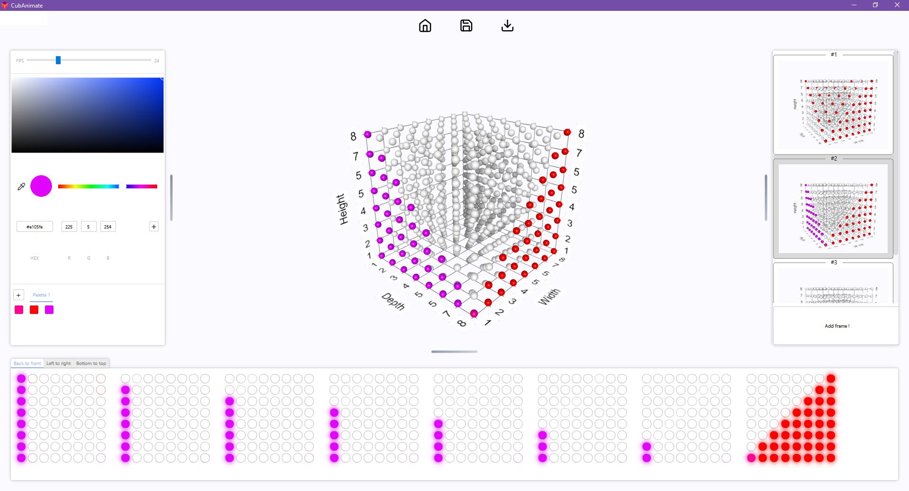

# CubAnimate: An LED-Cube animation tool

CubAnimate is an application to visually develop animations for LED-Cubes through a frame-by-frame editor, a HUE mode, or even based on three variables equations (x-axis, y-axis, time). All animations can be exported as ```.anim```, which are formatted plain-text files. This allowed us to run animations on any micro-processor smoothly.

Frame-by-frame editor             |  HUE editor
:--------------------------------:|:---------------------------:
  |  


## Installation

Make sure that Python 3.7 or above is installed.

1. Git clone the repository:
   
   `git clone https://github.com/ArthurFDLR/CubAnimate`

2. Use the configuration file [`.\requirements.txt`](https://github.com/ArthurFDLR/Commonsense-Reasoning-Bot/blob/master/requirements.txt) in the Python 3.7+ environment of your choice. For example:
   
   `python -m venv venv`

   `.\venv\Scripts\activate`

   `python -m pip install -r requirements.txt`

3. Define the size of your LED-Cube in [`./CubAnimate/__init__.py`](https://github.com/ArthurFDLR/CubAnimate/blob/master/CubAnimate/__init__.py)

4. You should now be able to run the application
   
   `python -m CubAnimate`